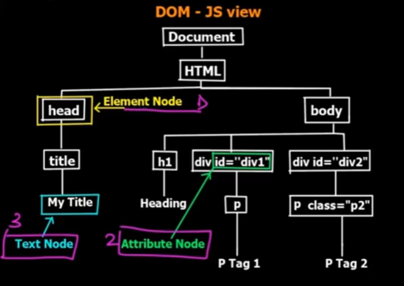
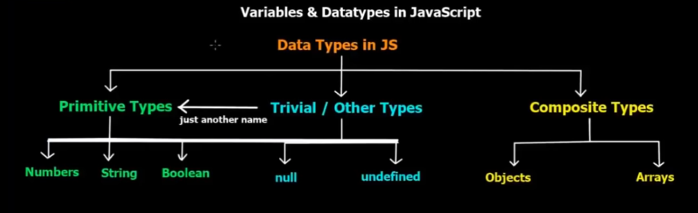
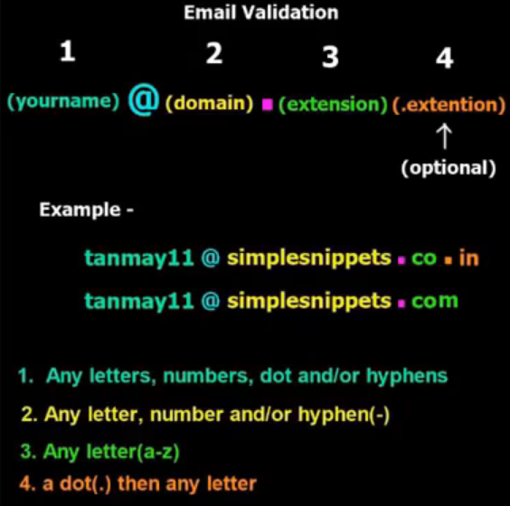

# JavaScript Course

## Intro to JavaScript


### JavaScript Document Object Model:

Document Object Model consists of nodes like:

- Element nodes: Here, the tags are called the element nodes
- Attribute Nodes: Attributes present in the tags are called attribute Nodes.
- Text Nodes: The actual content between an opening tag and a closing tag is called text node.




### Data types in JavaScript:




- JavaScript runs code line by line i.e, after running the first line it goes on to the other lines below the first line.

### JavaScript as a two props:

- JavaScript is a loosely typed language.
- JavaScript is also a dynamically typed language
  - Meaning to above statements is :
  - we can create a variable without declaring the variable type
    - ```javascript
      Eg: var a = 5;
      ```
    
    - ```javascript
      var b = "hello";                 
      ```
  - Both the examples are valid and+ we can see that we are not declaring the type variable it is. This explains that JavaScript is a loosely typed language.
  - Coming to dynamically typed language:
    - ```javascript
      Eg:  var a = 5;
      ```
    
    - ```javascript
      var a = "hello"; 
      ```
  - Above example is also valid and we can see that here variable 'a' is both an integer as well as a string hence JavaScript is a dynamically typed language.


- *If else and loops are as similar to the other languages*


**JavaScript treats the whole HTML as document so, in order to get anything from the HTML blocks or post anything to the HTML we need to *document.* statement to access the nodes.**

**Eg: *document.write(" < h2 >Hello world</ h2> ");* inserts the HTML code into the actual HTML.**


### Syntax of some basic statements:

- ```  javascript
  var variable_name;  or simply var_name = 5;
  ```

- ``` javascript
  if(/* condition(s) here */) {/* code here */} else { /*  code here */ }
  ```

- ```javascript
  switch (variable) {/* cases here */}
  ```
  
  - Here the important one is that **variable passed to switch statement can be a integer, string, bool**
  
- ```javascript
  function name(/* inputs here */){/* code here */}
  ```


### Associativity:

- JavaScript is evaluated from left to right while doing arithmetic operations having same operators.
- When having different operators we use BODMAS rule to evaluate.
- **Important point here is result = 6+9+"hello"+9+1; will be result = "15hello91"**
  - What happening here is as the associativity is from left to right JavaScript evaluates the integers and later on there is a string so it treats the later on variables as string and does concatenation.

### Scopes:

- As normal to other programming languages the scope is same here.
- **Variables declared by simply assigning value to them are by default global and some browsers don't restrict this type.**


### Arrays 

- **Arrays here are dynamic in nature** like vectors in c++. so, we can also push new elements after creating an array.
  - ``` javascript
    Eg:  var arr = [1,2,3];
    ```
  
  -  ``` javascript
     arr.push(4);
     ```
  
- Above is valid and the array *arr* will be [1,2,3,4].


## OOPS

### Objects

Eg: Below is a example of an object

```javascript
var car{
    
	car_brand: "Tesla",
	car_model: "Model 3",
	price: 35000,
	teslaAutoPilot: function(){
		document.wrie("<h2> Tesla is a legend. </h2>");
	}
    
}
```

*From above car object we can access it's model name using car.car_model and price by car.price etc.....*


- We can also create objects of data types like integer, string, boolean by defining with the new keyword.

- ```javascript
  var str1 = new String();
  ```

- ```javascript
  str1.length // gives the length of string
  //Here, str1 is an object and if we create a variable like
  
  var str2 = "hello"; //Now, str2 is a string.
  ```

- We can also add other properties to the existing objects then we can also create it outside the object declaration like:

- ```javascript
  var car{
      
  	car_brand: "Tesla",
  	car_model: "Model 3",
  	price: 35000,
  	teslaAutoPilot: function(){
  		document.wrie("<h2> Tesla is a legend. </h2>");
  	}
      
  }
  
  car.fueltype = "Electric";
  
  //Now, car also has a property named fueltype => car.fueltype returns "Electric".
  ```

- Similarly we can also delete the properties like:

- ```javascript
  delete car.price; 
  ```


### **Function Constructors**

These are just like the constructors in the C++ classes where we pass the parameters to get an object.

**Example**:

```javascript
function car(car_brand, car_model, price){

	this.car_brand = car_brand;
    this.car_model = car_model;
    this.price = price;
    this.func(){
        document.write(<h2> Tesla is a Legend </h2>);
    }

}
```

Now create an object.

```javascript
var obj = new car('Tesla','Model B',35000);
```

**Now, we can access the variables like car_model etc.. using the dot(' . ') operator like ``` var price = obj.price; ```**


## DOM Manipulations

### Events using methods 

- ```javascript
  onclick = "func()" //is the attribute we need to give for this type of button events.
  ```

- ```javascript
  document.getElementById(/*id here*/); //returns the element node having the id passed
  ```

- ```javascript
  var str = document.getElementById("someheading"); 
  // Now, we can access the text node of this element using
  str.innerHTML; //gives the text node of the element node and we can also alter it using this.
  ```

- ```javascript
  /* Now, this */ document.getElementById();// returns only one object so if we want to change multiple objects then we use
  
  document.getElementsByTagName(); // and this returns a list of js objects having the same tagname passed.
  ```

- ```javascript
  /* Similarly as above we can also get the elements using classes by */ document.getElementsByClassName(); // and this returns a list of js objects having the same class passed.
  ```

- ```javascript
  /* Similarly as above we can also get the elements using classes by */ document.getElementsByName(); // and this returns a list of js objects having the same class passed.
  ```

  

**We can access the attributes and change them using the dot operator.**


### MOUSE Events:

- ```javascript
  onmouseover = "func()", onmouseout = "other_func()" 
  //are the attributes we need to give for this type of mouse events namely mouse hover function and mouse non hover functions.
  ```

  

### Form Validations:

- ```html
  <form>
     <!-- This tag is specifically used to submit/POST user inputs and we can't submit/POST without using it. This doesn't change the way the website looks but used for POST requests. --> 
  </form>
  
   <!-- Button needs to be a type of submit specifically -->
  ```

- ```html
  <script>
  	function validate(){
          var user = document.getElementById("username");
          var pass = document.getElementById("password");
          if (user.value.trim() == "" || pass.value.trim() = "") {
              alert("No Blank Values allowed");
              return false;
          } else {
              return true;
          }
      }
  </script>
  
  <form onsubmit="return validate()" action="page.html">
      <input id="username" type="text" placeholder="username"><br>
      <input id="password" type="password" placeholder="password"><br>
      <button type="submit" onclick="check()"> Submit </button>
  </form>
  ```

- The above HTML code takes input namely username and password and checks if it's not null and if  so, it redirects to "page.html". **Important thing here is the attribute of form tag onsubmit having return statement in the attribute value indicating the dynamic nature i.e, the attribute activates when the onsubmit attribute is true and it will become true iff and only iff the validate() function returns true. and if we remove the return statement in the onsubmit attribute value then it redirects independent of the boolean value returned by the validate() function.

- ```html
  // This form validates the username and password and indicate invalid entry iff any
  <script>
  	function validate(){
          var user = document.getElementById("username");
          var pass = document.getElementById("password");
          
          if (user.value.trim() == "") {
              alert("Blank Username");
              user.style.border = "solid 3px red"; // makes the border red indicating invalid entry
              document.getElementById("lbluser").style.visibility = "visible"; //A red label indicating invalid entry
              return false;
          } else if (pass.value.trim() = "") {
              alert("Blank Password");
              pass.style.border = "solid 3px red"; // makes the border red indicating invalid entry
              return false;
          } else if(pass.value.length < 5) {
              alert("Password minimum length is 5");
              return false;
          } else {
              return true;
          }
      }
  </script>
  
  <form onsubmit="return validate()" action="page.html">
      <input id="username" type="text" placeholder="username"><br>
      <label id="lbluser" style="color:red; visibility: hidden;">Invalid</label>
      <input id="password" type="password" placeholder="password"><br>
      <button type="submit" onclick="check()"> Submit </button>
  </form>
  ```


### **Regular Expressions:**

**These are the expressions/patterns that are present in the usernames that are used to identify whether the username is valid or not.**

```html
//In this we check whether the entered username is having specific patterns like our rollno startswith B18xxxxEC etc...

//Here the postion of the regular expression is not concerned ut the content in the regualr expression is of the concern.

<script>
	function validate(){
        var user = document.getElementById("username").value;
        var regx = /B18/; //regular expression used for checking
        if (regx.test(user)) {
            alert("Valid Username");
            return true;
        } else {
            alert("Invalid Username");
            document.getElementById("lbluser").style.visibility = "visible"; //A red label indicating invalid entry
            return false;
        }
    }
</script>

<form onsubmit="return validate()" action="page.html">
    <input id="username" type="text" placeholder="username">
    <label id="lbluser" style="color:red; visibility: hidden;">Invalid</label><br>
    <button type="submit" onclick="check()"> Submit </button>
</form>
```


- Specially here we have inbuilt functions to check the regular expressions like test() in the above example and for making the regular expression case insensitive i.e, not checking the case of the testing text we can use the syntax like: **/B18/i**. The 'i' here indicates the regular expression is case insensitive.

- Now, here we check the regular expression for more general cases like B18, B19 etc..

  ```html
  //In this we check whether the entered username is having specific patterns like our rollno startswith B18xxxxEC and also B19xxxxEC also.
  
  <script>
  	function validate(){
          var user = document.getElementById("username").value;
          var regx = /B1[89][0-9]{4}EC/; //regular expression used for checking
          if (regx.test(user)) {
              alert("Valid Username");
              return true;
          } else {
              alert("Invalid Username");
              document.getElementById("lbluser").style.visibility = "visible"; //A red label indicating invalid entry
              return false;
          }
      }
  </script>
  
  <form onsubmit="return validate()" action="page.html">
      <input id="username" type="text" placeholder="username">
      <label id="lbluser" style="color:red; visibility: hidden;">Invalid</label><br>
      <button type="button" onclick="check()"> Submit </button>
  </form>
  ```

- Here, in regx = /B1[89]/; we are saying that the regular expression can also contain the B19 or B18 by indicating them in the square brackets giving a character set. We can also mention the range in the regular expression by something like: [a-x] meaning: the letter can be anything from a to x.
- If we want to exclude something in the regular expression we can indicate it by [ ^ *expression to exclude*] and here we can also indicate a range like [ ^ a-x] indicating we don't anything from a-x.
- Now, if we want to repeatedly identify the same characterset then we can use {num} indicating we are identifying 'num' number of times whether the given character set is present or not.
  - Eg: [0-9]{5} checks the given input has any 5 consequent numbers having the range from 0-9.

- **Special Charecters:**
  - \d is short form of [0-9].
  - \w is short form of [a-z, A-Z, 0-9 & _].
  - \s is short form of white space characters like tab and space.
  - \t matches tab only.

- **Mobile Number Validation:**

  ```html
  //In this we check whether the entered username is having specific patterns like our rollno startswith B18xxxxEC and also B19xxxxEC also.
  
  <script>
  	function validate(){
          var user = document.getElementById("number").value;
          var regx = /^[7-9]\d{9}$/; //mobile number check
          if (regx.test(user)) {
              alert("Valid number");
              return true;
          } else {
              alert("Invalid number");
              document.getElementById("lbluser").style.visibility = "visible"; //A red label indicating invalid entry
              return false;
          }
      }
  </script>
  
  <form onsubmit="return validate()" action="page.html">
      <input id="number" type="text" placeholder="Phone Number">
      <label id="lbluser" style="color:red; visibility: hidden;">Invalid</label><br>
      <button type="button" onclick="check()"> Submit </button>
  </form>
  ```

- Here, when we enter a valid number and some other trash also the output will be valid if not done as above because we just check whether the character set is present in the input text or not hence it's valid.
- In the above case for checking the mobile number we added two new symbols namely '^,$' these indicates that the text given as input must have the specified chracterset as the starting and ending respectively.

- '^' means that the given text can't start with some thing other than the character set specified and the '$' means that the given text can't end with some thing other than the character set specified. Thus, restricting the length of the input.

**Some important symbols used in this:**

- '.' dot operator indicating anything that can be present.
- '()' indicating groups, this can be used when there are multiple divisions in the input like in the case of email which consists name and @ symbol and the extension like gmail and other extension like '.com' etc.......
- '+' indicating we need to evaluate the character set more than once (this can be used when we don't know the length of the input text ).
- '?' makes some group optional i.e, the test() function returns true if the input text doesn't satisfy the optional condtions

**Similarly we can check an email with the character set:** 

``` javascript
regx = /^ ([a-z A-Z 0-9 \.-]+)@([a-z A-Z 0-9 -]+).([a-z]{2,8}) (.[a-z]{2,8})? $/;
```

Groups :




### Timing Functions:

- There are 4 functions available for setting and clearing the timer they are:
- **setTimeout():** This starts a timer for certain specified time and runs a function after that timer completes it the given period of time. **This is used only when we want run a function once not repeatedly.** 
  - Syntax: setTimeout(func,time_in_milliseconds)

- Now if we want to stop this time mentioned above before completing the given period of time, then we need to use a function called clearTimeout(); by passing an ID.

  - Here, we need to pass an ID for the clearTimeout() function and this ID is obtained when the timer is started by the setTimeout() function.

  - ```javascript
    //Example:
    window.setTimeout(func,5000); //starting a timer which counts for 5secs and then starts the function 'func()'
    
    //for getting the ID of the setTimeout() function we just treat it as some function returning the ID and store in a variable i.e,
        
    ID = window.setTimeout(func,5000); //returns te ID of the timer
    
    //now, lets stop it.
    window.clearTimeout(ID);
    ```

  - In the above window is another object like "**document**" using which we can access some functions like this.

- Now, if we want to run a function continuously after each constant period of time then we use another function called setInterval() with same syntax as setTimeout(). Difference is that the time passed here is the time used to frequently run the passed function after the passed period of time.
- Similarly we clear/stop the timer using the same ID method as above.


### Animations:

- Here we use setInterval() and start the function which reduces the opacity value of the image by 0.1 each time function is called thus we achieve animations.

- ```javascript
  var opacity = 0;
  var ID = 0;
  function hide(){
      var img = document.getElementById("img_id");
      //get the opacity value
      opacity = Number(window.getComputedStyle(img).getPropertyValue("opacity")); 
      if(opacity > 0){
          opacity -= 0.1;
          img.style.opacity = opacity; //modify the opacity
      }
      if(opacity == 0)
          clearInterval(ID);
      
  }
  function fadeout(){
      ID = window.setInterval(hide,20);
  }
  
  function hide(){
      var img = document.getElementById("img_id");
      //get the opacity value
      opacity = Number(window.getComputedStyle(img).getPropertyValue("opacity")); 
      if(opacity < 1){
          opacity += 0.1;
          img.style.opacity = opacity; //modify the opacity
      }
      if(opacity == 1)
          clearInterval(ID);
      
  }
  
  function fadein(){
      ID = window.setInterval(show,20); //20 is in milliseconds so for smoother animation it is small
  }
  ```

- Similarly we can increase the height, width for making a ♥ (heart symbol) act as a animated symbol.

- ```html
  <html>
  	<head>
   		<title>Basic Animations Part 2 - scaling</title>
  		<script type="text/javascript">
  		
  		var width=100;
  		var difference=2;
  		var interveralID =0;
  		//document.getElementById("img1").style.width=width;
  
  		function increase(){
  			clearInterval(interveralID);
  			interveralID=setInterval(expand,10);
  		}
  		function decrease(){
  			clearInterval(interveralID);
  			interveralID=setInterval(shrink,10);
  		}
  		function expand(){
  			if(width<200){
  				width = width+difference;
  				document.getElementById("img1").style.width=width;
  				console.log(width);
  			}else{
  				clearInterval(interveralID);
  			}
  		}
  		function shrink(){
  			if(width>100){
  				width = width-difference;
  				document.getElementById("img1").style.width=width;
  				console.log(width);
  			}else{
  				clearInterval(interveralID);
  			}
  		}
  	
  		</script>
  	</head>
  	
      <body>
          <br>
  		<br>
  
      </body>
  
  </html>
  
  ```

  

