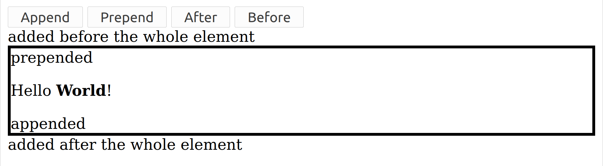
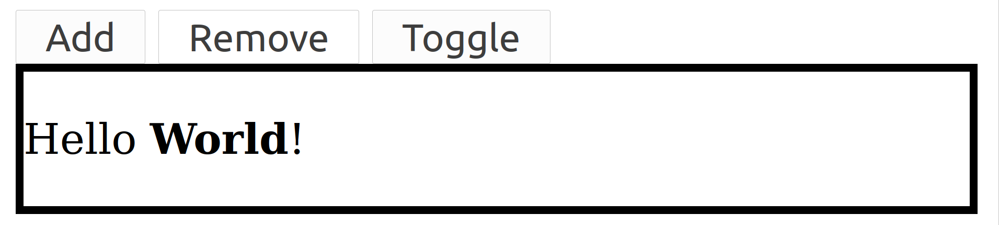
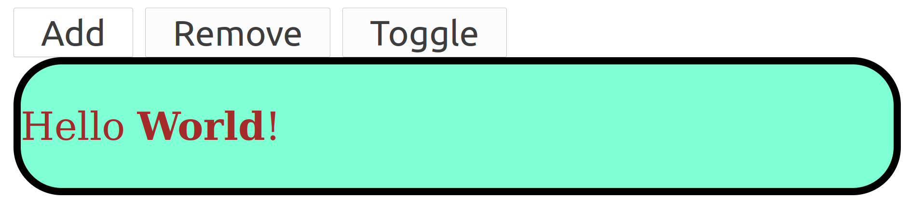
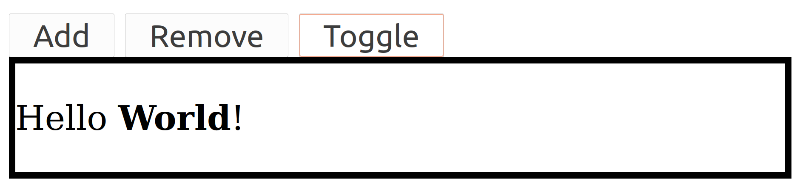
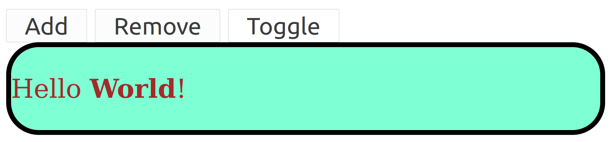

## Intro to jQuery library

This is a JavaScript **library** where the functions are pre-written and we are able to use it thus easing our work and it's compatible with all browsers.

### jQuery Selectors:

These allow you to select and manipulate the element nodes tn the HTML.

Example:

```html
<body>
    <h1>
        Welcome to jQuery
    </h1>
    <button onclick="func()" id="btn">
        Clickme
    </button>
</body>

<!-- this is jquery library access using CDN's -->
<script src="https://cdnjs.cloudflare.com/ajax/libs/jquery/3.6.0/jquery.min.js" integrity="sha512-894YE6QWD5I59HgZOGReFYm4dnWc1Qt5NtvYSaNcOP+u1T9qYdvdihz0PPSiiqn/+/3e7Jo4EaG7TubfWGUrMQ==" crossorigin="anonymous" referrerpolicy="no-referrer"></script>

<!-- Now, using jQuery library functions below -->
<script>
	function func(){
        $("h1").fadeToggle(); //toggling using jQuery functions
    }
</script>

<!--- 
the syntax here is $("id/class/tag").action();
and the action() is any function in jQuery.
--->
```

- In above example ``` fadeToggle() ``` is a function for fading and we can pass time it takes to fade as parameter also like: ``` fadeToggle(2000) ``` meaning fade it for 2000ms => 2seconds.

- **We can also pass multiple classes/id's/tags in the $ selector like:** 

- ```html
  <body>
      <h1 id="h1">
          Welcome to jQuery.
      </h1>
      
      <div id="fp" class="mydivs">
          <p>
              This is first paragraph.
          </p>
      </div>
      
      <div id="sp" class="mydivs">
          <p>
              This is Second paragraph.
          </p>
      </div>
      
      <div id="tp" class="mydivs">
          <ul>
              <li>List1</li>
              <li>List2</li>
              <li>List3</li>
              <li>List4</li>
          </ul>
      </div>
      <button onclick="func()" id="btn">
          Clickme
      </button>
  </body>
  
  <!-- this is jquery library access using CDN's -->
  <script src="https://cdnjs.cloudflare.com/ajax/libs/jquery/3.6.0/jquery.min.js" integrity="sha512-894YE6QWD5I59HgZOGReFYm4dnWc1Qt5NtvYSaNcOP+u1T9qYdvdihz0PPSiiqn/+/3e7Jo4EaG7TubfWGUrMQ==" crossorigin="anonymous" referrerpolicy="no-referrer"></script>
  
  <!-- Now, using jQuery library functions below -->
  <script>
  	function func(){
          $("#fp,p,li").fadeToggle(); 
          //above will fadeaway the elements with id as fp and tags with p and li. Hence we can pass multiple id/tag/class
      }
  </script>
  
  ```

- Still to add is that we can also pass the id/class/tag as similar to css i.e, ``` $("div > p").fadeToggle(); ``` or ``` $("div p").fadeToggle(); ```  this will toggle only the paragraph tags under div tags 😉.

- Now, if we want to modify the properties i.e, apply js to first tags bearing specific tag/id/class then we can also do that by indicating ```:first``` after the tag/id/class similarly we can also add ```:even``` to modify properties of even numbered elements **Here, the numbering starts from 0** and similarly ```:odd```. Example: ```$("div:first").fadeToggle();``` hides the first div tag ``` $("div:even").fadeToggle(); ```  hides the even numbered div tags.

  

### Events from jQuery:

1. **click() event**

   - ```html
     <body>
         <h1 id="h1">
             Welcome to jQuery.
         </h1>
         
         <div id="fp" class="mydivs">
             <p>
                 This is first paragraph.
             </p>
         </div>
         
         <div id="sp" class="mydivs">
             <p>
                 This is Second paragraph.
             </p>
         </div>
         
         <div id="tp" class="mydivs">
             <ul>
                 <li>List1</li>
                 <li>List2</li>
                 <li>List3</li>
                 <li>List4</li>
             </ul>
         </div>
         <button id="btn">
             Clickme
         </button>
     </body>
     
     <!-- this is jquery library access using CDN's -->
     <script src="https://cdnjs.cloudflare.com/ajax/libs/jquery/3.6.0/jquery.min.js" integrity="sha512-894YE6QWD5I59HgZOGReFYm4dnWc1Qt5NtvYSaNcOP+u1T9qYdvdihz0PPSiiqn/+/3e7Jo4EaG7TubfWGUrMQ==" crossorigin="anonymous" referrerpolicy="no-referrer"></script>
     
     <!-- Now, using jQuery library functions below -->
     <script>
         $(document).ready(function(){ 
             //this loads only after the html document is loaded completely ensures misbehaviour
             
             //instead of giving the onclick attribute in HTML for the button we can also give it using js
             $("button").click(func);
             function func(){
                 $("#fp,p,li").fadeToggle(); 
             }
         });
     	
     </script>
     <!-- Above implementation or Below works -->
     <script>
         $(document).ready(function(){ 
             $("button").click(function(){
                 $("#fp,p,li").fadeToggle();  // define in the click event itself.
             } );
         });
     	
     </script>
     ```

2. **double click event => dblclick()**

   - This is similar to click() event but here, we need to click the button twice in order to trigger the function.

3. **mouseenter() and mouseleave() events simliar to hovering events**

   - ```html
     <body>
         <h1 id="h1">
             Welcome to jQuery.
         </h1>
         <button id="btn">
             Clickme
         </button>
     </body>
     
     <!-- this is jquery library access using CDN's -->
     <script src="https://cdnjs.cloudflare.com/ajax/libs/jquery/3.6.0/jquery.min.js" integrity="sha512-894YE6QWD5I59HgZOGReFYm4dnWc1Qt5NtvYSaNcOP+u1T9qYdvdihz0PPSiiqn/+/3e7Jo4EaG7TubfWGUrMQ==" crossorigin="anonymous" referrerpolicy="no-referrer"></script>
     
     <!-- Now, using jQuery library functions below -->
     <!-- using mouseenter() and mouseleave() -->
     <script>
         $(document).ready(function(){ 
             $("#btn").mouseenter(func1);//activated on hovering in 
             $("#btn").mouseleave(func1);//activated on hovering out
             function func1(){
                 $("h1").fadeOut(); 
             }
             function func2(){
                 $("h1").fadeIn(); 
             }
         });
     </script>
     <!-- using hover() function which is a combined version of mouseenter() and mouseleave() -->
     <script>
         $(document).ready(function(){ 
             $("#btn").hover(func1,func2);
             function func1(){
                 $("h1").fadeOut(); 
             }
             function func2(){
                 $("h1").fadeIn(); 
             }
         });
     </script>
     ```

     

### Effects:

1. **hide()**:
   - Used to hide some tag/id/class.

2. **show()**:
   - Used to unhide i.e, show the hided tag/id/class.

3. **toggle()**:
   - Used to do both hide() and show() using one single button.

Example:

```html
<body>
    <h1 id="h1">
        Welcome to jQuery.
    </h1>
    <button id="btn1">
        Hide
    </button>
    <button id="btn2">
        Show
    </button>
    <button id="btn3">
        Toggle
    </button>
</body>

<!-- this is jquery library access using CDN's -->
<script src="https://cdnjs.cloudflare.com/ajax/libs/jquery/3.6.0/jquery.min.js" integrity="sha512-894YE6QWD5I59HgZOGReFYm4dnWc1Qt5NtvYSaNcOP+u1T9qYdvdihz0PPSiiqn/+/3e7Jo4EaG7TubfWGUrMQ==" crossorigin="anonymous" referrerpolicy="no-referrer"></script>

<!-- Now, using jQuery library functions below -->
<script>
    $(document).ready(function(){ 
        $("#btn1").click(function(){
            $("h1").hide();
        }) ;
        $("#btn2").click(function(){
            $("h1").show();
        }) ;
        $("#btn3").click(function(){
            $("h1").toggle();
        }) ;
    });
</script>
```

4. **fadeOut()**:
   - fades out the selected ones.
5. **fadeIn()**:
   -  fades in the selected ones.
6. **fadeToggle()**:
   - toggles out the selected ones.

Example:

```html
<body>
    <h1 id="h1">
        Welcome to jQuery.
    </h1>
    <button id="btn1">
        fadeout
    </button>
    <button id="btn2">
        fadein
    </button>
    <button id="btn3">
        Toggle
    </button>
</body>

<!-- this is jquery library access using CDN's -->
<script src="https://cdnjs.cloudflare.com/ajax/libs/jquery/3.6.0/jquery.min.js" integrity="sha512-894YE6QWD5I59HgZOGReFYm4dnWc1Qt5NtvYSaNcOP+u1T9qYdvdihz0PPSiiqn/+/3e7Jo4EaG7TubfWGUrMQ==" crossorigin="anonymous" referrerpolicy="no-referrer"></script>

<!-- Now, using jQuery library functions below -->
<script>
    $(document).ready(function(){ 
        $("#btn1").click(function(){
            $("h1").fadeOut();
        }) ;
        $("#btn2").click(function(){
            $("h1").fadeIn();
        }) ;
        $("#btn3").click(function(){
            $("h1").fadeToggle(); 
        }) ;
    });
</script>
```

7. **slideUp():**
   - Fades/hides by moving up.
8. **slideDown():**
   - Shows/unhides by moving down.
9. **slideToggle():**
   - Toggle b/w Hideing & Unhideing by moving up and down.

```html
<!-- Same body as above examples -->
<script>
    $(document).ready(function(){ 
        $("#btn1").click(function(){
            $("h1").slideUp();
        }) ;
        $("#btn2").click(function(){
            $("h1").slideDown();
        }) ;
        $("#btn3").click(function(){
            $("h1").slideToggle(); 
        }) ;
    });
</script>
```


### Animations:

For moving some objects or tags (images or others) we use css height, width, padding etc.. to look it as an animation.

```html
<head>
<style>
    .cube{
        width: 50px;
        height: 50px;
        background-color: blueviolet;
        opacity: 0.4;
        position: absolute;
        padding: 20px;
    }
</style>
</head>

<body>
    <button id="anim">
        animate
    </button>
    <div id="cube" class="cube">
        <p>
            cube
        </p>
    </div>
</body>

<!-- this is jquery library access using CDN's -->
<script src="https://cdnjs.cloudflare.com/ajax/libs/jquery/3.6.0/jquery.min.js" integrity="sha512-894YE6QWD5I59HgZOGReFYm4dnWc1Qt5NtvYSaNcOP+u1T9qYdvdihz0PPSiiqn/+/3e7Jo4EaG7TubfWGUrMQ==" crossorigin="anonymous" referrerpolicy="no-referrer"></script>

<!-- Now, using jQuery library functions below -->
<script>
    $(document).ready(function(){ 
        $("#anim").click(function(){
            
            $("#cube").animate({
                //here we give the parameters to change
                left: '150px', //move from left to right by 150px;
                opacity:'1',
                width:'100px',
                height:'100px'
            },1000);
            
            /*
            so here the parameters passed to animate() are:
              1.props to change i.e, the css props to change while animating
              2.time to animate
            */
            
            //Note the syntax here its not semicolon 
            //it's the comma operator as in json files :)
            // and the values passed will be in 'quotes'
            
        }) ;
    });
</script>
```


### **callback()**:

Now, in the case where we want something to happen after the animations we use this callback() functions.

Example:

```html
<head>
    <style>
        .cube {
            width: 50px;
            height: 50px;
            background-color: blueviolet;
            opacity: 0.4;
            position: absolute;
            padding: 20px;
        }
    </style>
</head>

<body>
    <button id="anim">
        animate
    </button>
    <div id="cube" class="cube">
        <p>
            cube
        </p>
    </div>
</body>

<!-- this is jquery library access using CDN's -->
<script src="https://cdnjs.cloudflare.com/ajax/libs/jquery/3.6.0/jquery.min.js"
integrity="sha512-894YE6QWD5I59HgZOGReFYm4dnWc1Qt5NtvYSaNcOP+u1T9qYdvdihz0PPSiiqn/+/3e7Jo4EaG7TubfWGUrMQ==" crossorigin="anonymous" referrerpolicy="no-referrer"></script>

<!-- Now, using jQuery library functions below -->
<script>
    $(document).ready(function () {
        $("#anim").click(function () {

            $("#cube").animate({
                //here we give the parameters to change
                left: '150px', //move from left to right by 150px;
                opacity: '1',
                width: '100px',
                height: '100px'
            }, 1000, function () {
                alert("cube is animated");
            });

            /*so here the extra parameter passed to animate() is the callback function and this executes only after the animate effect is completely done.*/

            /*If we just write the alert() after the animate effct without the callback() then without even entirely completing the animate effect the alert() is executed.*/
        });
    });
</script>
```

### **Chaining:**

If we want multiple effects to be done simultaneously after a single click i.e, sliding up and then sliding down etc.. we use this method called chaining where we pass all the effects at once to the selector.

Example:

```html
<!--- same body head as previous one --->
<script>
    $(document).ready(function () {
        $("#anim").click(function () {

            $("#cube").animate({
                //here we give the parameters to change
                left: '150px', //move from left to right by 150px;
                opacity: '1',
                width: '100px',
                height: '100px'
            }, 1000, function () {
                alert("cube is animated");
            }).animate({
                //here we give the parameters to change
                left: '8px', //move from right to left by 150px;
                //note here the value of 8px is the default padding for the browser
                opacity: '1',
                width: '100px',
                height: '100px'
            }, 1000, function () {
                alert("cube is animated");
            });
            
            //here 2 animations takes place at a time
        });
    });
</script>
```

- **Note:** Here, left and right in the css properties is the distance from the left of the screen and the right of the screen. [Check this](https://stackoverflow.com/questions/67808008/multiple-jquery-animate-using-chaining-not-working-as-expected).


## DOM Manipulations

1. **text() method:**

- For getting the content in the tag i.e, the text node and equivalent to value in JavaScript.

```html
<body>
    <button id="btn">Click me</button>
    <p class="para">
        Hello <b>World</b>!
    </p>
</body>

<!-- this is jquery library access using CDN's -->
<script src="https://cdnjs.cloudflare.com/ajax/libs/jquery/3.6.0/jquery.min.js" integrity="sha512-894YE6QWD5I59HgZOGReFYm4dnWc1Qt5NtvYSaNcOP+u1T9qYdvdihz0PPSiiqn/+/3e7Jo4EaG7TubfWGUrMQ==" crossorigin="anonymous" referrerpolicy="no-referrer"></script>

<script>
	
    $(document).ready(function(){
        $("#btn").click(function(){
            var temp = $("#para").text(); //gets the content in the tag
            //here, temp = "Hello World!"
            $("#para").text("Change the text"); //changes the content inside
        });
    });
    
</script>
```

- Note: ```$("#para").text("Change the text");``` changes the text in corresponding id here. If we see the same text() method can be used for fetching the text and setting the text.

2. **html() method:**

Similar to the text() method but here, we also get the content with the inner tags also i.e, if there are any other tags that are used inside the content which we are accessing then, we will get that tag also(whole tag as code).

Example:

```html
<body>
    <button id="btn">Click me</button>
    <p id="para">
        Hello <b>World</b>!
    </p>
</body>

<!-- this is jquery library access using CDN's -->
<script src="https://cdnjs.cloudflare.com/ajax/libs/jquery/3.6.0/jquery.min.js" integrity="sha512-894YE6QWD5I59HgZOGReFYm4dnWc1Qt5NtvYSaNcOP+u1T9qYdvdihz0PPSiiqn/+/3e7Jo4EaG7TubfWGUrMQ==" crossorigin="anonymous" referrerpolicy="no-referrer"></script>

<script>
	
    $(document).ready(function(){
        $("#btn").click(function(){
            var temp = $("#para").html(); //gets the content in the tag
            // here, temp = "Hello <b>World</b>!"
        });
    });
    
</script>
```

**Note:** If we check text() and html(), html() returns the exact code which is in the content while the text() method only returns the text not including the bold nature inside the text or any others.

3. **attr() method:**

Gets the attributes of the tags/id/class and also able to modify them.

```html
<body>
    <button id="btn">Click me</button>
    <p id="para">
        Hello <b>World</b>!
    </p>
</body>

<!-- this is jquery library access using CDN's -->
<script src="https://cdnjs.cloudflare.com/ajax/libs/jquery/3.6.0/jquery.min.js" integrity="sha512-894YE6QWD5I59HgZOGReFYm4dnWc1Qt5NtvYSaNcOP+u1T9qYdvdihz0PPSiiqn/+/3e7Jo4EaG7TubfWGUrMQ==" crossorigin="anonymous" referrerpolicy="no-referrer"></script>

<script>
	
    $(document).ready(function(){
        $("#btn").click(function(){
            var temp = $("#para").attr("id"); //gets what id is present in that
            //similarly we can access the attributes for that specific tag/class/id which we have passed.
            
            //below for changing/setting the attributes
            $("#para").attr("id","newid");
            //we need to pass the new attribute as the second argument.
        });
    });
    
</script>
```

4. **css() method:**

Gets the css styles of the element and also able to modify them.

Similar to above example.

5. **append() method:** 

   Inserts content at the end of the selected elements.

6. **prepend() method:**

   Inserts content at the start of the selected elements.

7. **after() method:**

   Inserts content after the selected elements.

8. **before() method:**

   Inserts content after the selected elements.

Example for above 4 methods:

```html
<style>
    .some{
        border: 3px solid black; /*just the border*/
    }
</style>
<body>
    <button id="btn1">Append</button>
    <button id="btn2">Prepend</button>
    <button id="btn3">After</button>
    <button id="btn4">Before</button>
    <div class="some">
    	<p id="para">
            Hello <b>World</b>!
        </p>
    </div>
</body>

<!-- this is jquery library access using CDN's -->
<script src="https://cdnjs.cloudflare.com/ajax/libs/jquery/3.6.0/jquery.min.js" integrity="sha512-894YE6QWD5I59HgZOGReFYm4dnWc1Qt5NtvYSaNcOP+u1T9qYdvdihz0PPSiiqn/+/3e7Jo4EaG7TubfWGUrMQ==" crossorigin="anonymous" referrerpolicy="no-referrer"></script>

<script>
	
    $(document).ready(function(){
        $("#btn1").click(function(){
            $("para").append("appended");
        });
        $("#btn2").click(function(){
            $("para").prepend("prepended");
        });
        $("#btn3").click(function(){
            $("para").after("added after the whole element");
        });
        $("#btn4").click(function(){
            $("para").before("added before the whole element");
        });
    });
    
</script>
```

Output will be:



Here, for clarity we used the border and if we see it clearly after adds the text passed after the element while append just appends the text in the element passed itself. Similarly with prepend (prepends in the same element) and before adds before the whole element.

9. **remove() method:**

   As the name suggests it completely removes the element itself i.e, delete the element from the HTML. Here, element can be a tag or a class or an id. We can pass multiple elements by using a comma operator.

10. **empty() method:**

    While empty() just empties the content inside the tag i.e, makes the content inside the element nill(nothing).


**So, if we want to add some set of css styles we can also write them in the css file and then just apply the styles using below methods.**

11. **addClass() method:**

    This adds the css styles of a particular class to the selected element.

12. **removeClass() method:**

    This removes the css styles of a particular class to the selected element.

13. **toggleClass() method:**

    This toggles the css styles of a particular class to the selected element.

Example:

```html
<head>
    <style>
        .some {
            border: 3px solid black;
            /*just the border*/
        }
        .newsome{
            border-radius: 20px;
            background-color: aquamarine;
            color: brown;
        }
    </style>
</head>


<body>
    <button id="btn1">Add</button>
    <button id="btn2">Remove</button>
    <button id="btn3">Toggle</button>
    <br>
    <div class="some">
        <p id="para">
            Hello <b>World</b>!
        </p>
    </div>
</body>

<!-- this is jquery library access using CDN's -->
<script src="https://cdnjs.cloudflare.com/ajax/libs/jquery/3.6.0/jquery.min.js"
    integrity="sha512-894YE6QWD5I59HgZOGReFYm4dnWc1Qt5NtvYSaNcOP+u1T9qYdvdihz0PPSiiqn/+/3e7Jo4EaG7TubfWGUrMQ=="
    crossorigin="anonymous" referrerpolicy="no-referrer"></script>

<script>
    $(document).ready(function () {
        $("#btn1").click(function () {
            $(".some").addClass("newsome"); 
            //adding the styles of the newsome class
        });
        $("#btn2").click(function () {
            $(".some").removeClass("newsome");
            //removing the styles of the newsome class
        });
        $("#btn3").click(function () {
            $(".some").toggleClass("newsome");
            //toggling the styles of the newsome class
        });
    });
</script>
```




<center><b>Initial View</b></center>



<center><b>After Clicking add button</b></center>





<center><b>Doing the same using Toggle button</b></center>


